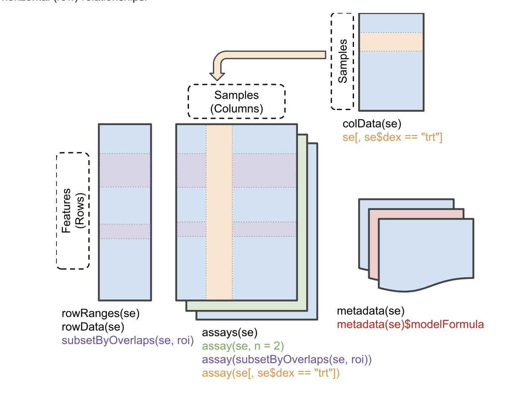

``` r
library(dplyr)
```

```
## 
## Attaching package: 'dplyr'
```

```
## The following objects are masked from 'package:stats':
## 
##     filter, lag
```

```
## The following objects are masked from 'package:base':
## 
##     intersect, setdiff, setequal, union
```


SummarizedExperiment for Coordinating Experimental Assays, Samples, and Regions of Interest

Martin Morgan, Valerie Obenchain, Jim Hester, Hervé Pagès

Revised: 5 Jan, 2023

Contents

1 Introduction
2 Anatomy of a SummarizedExperiment
2.1 Assays
2.2 ‘Row’ (regions-of-interest) data
2.3 ‘Column’ (sample) data
2.4 Experiment-wide metadata
3 Constructing a SummarizedExperiment
4 Top-level dimnames vs assay-level dimnames
5 Common operations on SummarizedExperiment
5.1 Subsetting
5.2 Getters and setters
5.3 Range-based operations
6 Interactive visualization
7 Session information
1 Introduction

The SummarizedExperiment class is used to store rectangular matrices of experimental results, which are commonly produced by sequencing and microarray experiments. Note that *SummarizedExperiment can simultaneously manage several experimental results or assays as long as they be of the same dimensions*.

Each object stores observations of one or more samples, along with additional meta-data describing both the observations (features) and samples (phenotypes).

A key aspect of the SummarizedExperiment class is the coordination of the meta-data and assays when subsetting. For example, if you want to *exclude a given sample you can do for both the meta-data and assay in one operation*, which ensures the meta-data and observed data will remain in sync. Improperly accounting for meta and observational data has resulted in a number of incorrect results and retractions so this is a very desirable property.

SummarizedExperiment is in many ways similar to the historical ExpressionSet, the main distinction being that SummarizedExperiment is more *flexible in it’s row information*, allowing both GRanges based as well as those described by arbitrary DataFrames. This makes it ideally suited to a variety of experiments, particularly sequencing based experiments such as RNA-Seq and ChIp-Seq.

#2 Anatomy of a SummarizedExperiment

The SummarizedExperiment package contains *two classes*: *SummarizedExperiment* and *RangedSummarizedExperiment.*

*SummarizedExperiment* is a matrix-like container where *rows represent features of interest* (e.g. *genes*, *transcripts*, *exons*, etc.) and *columns* represent *samples.* 

The *objects contain one or more assays*, each represented by a matrix-like object of numeric or other mode. The *rows* of a SummarizedExperiment object represent *features of interest*. 

*Information about these features is stored in a DataFrame object*, accessible using the function *rowData*(). Each row of the DataFrame provides information on the feature in the corresponding row of the SummarizedExperiment object. 

*Columns* of the DataFrame represent different *attributes of the features of interest*, e.g., *gene* or transcript IDs, etc.

*RangedSummarizedExperiment* is the *child of the SummarizedExperiment* class which means that *all the methods on SummarizedExperiment also work* on a RangedSummarizedExperiment.

The fundamental difference between the two classes is that the *rows of a RangedSummarizedExperiment object represent genomic ranges of interest* instead of a DataFrame of features. The RangedSummarizedExperiment ranges are *described by a GRanges* or a GRangesList object, *accessible using the rowRanges()* function.

The following graphic displays the class geometry and highlights the vertical (column) and horizontal (row) relationships.



Summarized Experiment
Summarized Experiment
#2.1 Assays

The *airway* package contains an example dataset from an *RNA-Seq experiment of read counts per gene* for airway smooth muscles. 

These data are stored in a RangedSummarizedExperiment object which contains *8 different experimental and assays 64,102 gene transcripts*.


``` r
library(SummarizedExperiment)
```

```
## Loading required package: MatrixGenerics
```

```
## Loading required package: matrixStats
```

```
## 
## Attaching package: 'matrixStats'
```

```
## The following object is masked from 'package:dplyr':
## 
##     count
```

```
## 
## Attaching package: 'MatrixGenerics'
```

```
## The following objects are masked from 'package:matrixStats':
## 
##     colAlls, colAnyNAs, colAnys, colAvgsPerRowSet, colCollapse,
##     colCounts, colCummaxs, colCummins, colCumprods, colCumsums,
##     colDiffs, colIQRDiffs, colIQRs, colLogSumExps, colMadDiffs,
##     colMads, colMaxs, colMeans2, colMedians, colMins, colOrderStats,
##     colProds, colQuantiles, colRanges, colRanks, colSdDiffs, colSds,
##     colSums2, colTabulates, colVarDiffs, colVars, colWeightedMads,
##     colWeightedMeans, colWeightedMedians, colWeightedSds,
##     colWeightedVars, rowAlls, rowAnyNAs, rowAnys, rowAvgsPerColSet,
##     rowCollapse, rowCounts, rowCummaxs, rowCummins, rowCumprods,
##     rowCumsums, rowDiffs, rowIQRDiffs, rowIQRs, rowLogSumExps,
##     rowMadDiffs, rowMads, rowMaxs, rowMeans2, rowMedians, rowMins,
##     rowOrderStats, rowProds, rowQuantiles, rowRanges, rowRanks,
##     rowSdDiffs, rowSds, rowSums2, rowTabulates, rowVarDiffs, rowVars,
##     rowWeightedMads, rowWeightedMeans, rowWeightedMedians,
##     rowWeightedSds, rowWeightedVars
```

```
## Loading required package: GenomicRanges
```

```
## Loading required package: stats4
```

```
## Loading required package: BiocGenerics
```

```
## 
## Attaching package: 'BiocGenerics'
```

```
## The following objects are masked from 'package:dplyr':
## 
##     combine, intersect, setdiff, union
```

```
## The following objects are masked from 'package:stats':
## 
##     IQR, mad, sd, var, xtabs
```

```
## The following objects are masked from 'package:base':
## 
##     anyDuplicated, aperm, append, as.data.frame, basename, cbind,
##     colnames, dirname, do.call, duplicated, eval, evalq, Filter, Find,
##     get, grep, grepl, intersect, is.unsorted, lapply, Map, mapply,
##     match, mget, order, paste, pmax, pmax.int, pmin, pmin.int,
##     Position, rank, rbind, Reduce, rownames, sapply, setdiff, table,
##     tapply, union, unique, unsplit, which.max, which.min
```

```
## Loading required package: S4Vectors
```

```
## 
## Attaching package: 'S4Vectors'
```

```
## The following objects are masked from 'package:dplyr':
## 
##     first, rename
```

```
## The following object is masked from 'package:utils':
## 
##     findMatches
```

```
## The following objects are masked from 'package:base':
## 
##     expand.grid, I, unname
```

```
## Loading required package: IRanges
```

```
## 
## Attaching package: 'IRanges'
```

```
## The following objects are masked from 'package:dplyr':
## 
##     collapse, desc, slice
```

```
## Loading required package: GenomeInfoDb
```

```
## Loading required package: Biobase
```

```
## Welcome to Bioconductor
## 
##     Vignettes contain introductory material; view with
##     'browseVignettes()'. To cite Bioconductor, see
##     'citation("Biobase")', and for packages 'citation("pkgname")'.
```

```
## 
## Attaching package: 'Biobase'
```

```
## The following object is masked from 'package:MatrixGenerics':
## 
##     rowMedians
```

```
## The following objects are masked from 'package:matrixStats':
## 
##     anyMissing, rowMedians
```

``` r
data(airway, package="airway")
se <- airway
```


``` r
se
```

```
## class: RangedSummarizedExperiment 
## dim: 63677 8 
## metadata(1): ''
## assays(1): counts
## rownames(63677): ENSG00000000003 ENSG00000000005 ... ENSG00000273492
##   ENSG00000273493
## rowData names(10): gene_id gene_name ... seq_coord_system symbol
## colnames(8): SRR1039508 SRR1039509 ... SRR1039520 SRR1039521
## colData names(9): SampleName cell ... Sample BioSample
```

Se object has:

One assay called counts
rownames are ENS genes IDs
rowData conatins 10 categories of meta data describing the genes examined
colNames contain eight sample IDs
colData contains 9 categories of meta data describing the samples


``` r
class(se)
```

```
## [1] "RangedSummarizedExperiment"
## attr(,"package")
## [1] "SummarizedExperiment"
```

``` r
rowData(se) # meta data about the features of interest - e.g. gene-associated data (start and end, protein-coding or non-coding etc)
```

```
## DataFrame with 63677 rows and 10 columns
##                         gene_id     gene_name  entrezid   gene_biotype
##                     <character>   <character> <integer>    <character>
## ENSG00000000003 ENSG00000000003        TSPAN6        NA protein_coding
## ENSG00000000005 ENSG00000000005          TNMD        NA protein_coding
## ENSG00000000419 ENSG00000000419          DPM1        NA protein_coding
## ENSG00000000457 ENSG00000000457         SCYL3        NA protein_coding
## ENSG00000000460 ENSG00000000460      C1orf112        NA protein_coding
## ...                         ...           ...       ...            ...
## ENSG00000273489 ENSG00000273489 RP11-180C16.1        NA      antisense
## ENSG00000273490 ENSG00000273490        TSEN34        NA protein_coding
## ENSG00000273491 ENSG00000273491  RP11-138A9.2        NA        lincRNA
## ENSG00000273492 ENSG00000273492    AP000230.1        NA        lincRNA
## ENSG00000273493 ENSG00000273493  RP11-80H18.4        NA        lincRNA
##                 gene_seq_start gene_seq_end              seq_name seq_strand
##                      <integer>    <integer>           <character>  <integer>
## ENSG00000000003       99883667     99894988                     X         -1
## ENSG00000000005       99839799     99854882                     X          1
## ENSG00000000419       49551404     49575092                    20         -1
## ENSG00000000457      169818772    169863408                     1         -1
## ENSG00000000460      169631245    169823221                     1          1
## ...                        ...          ...                   ...        ...
## ENSG00000273489      131178723    131182453                     7         -1
## ENSG00000273490       54693789     54697585 HSCHR19LRC_LRC_J_CTG1          1
## ENSG00000273491      130600118    130603315          HG1308_PATCH          1
## ENSG00000273492       27543189     27589700                    21          1
## ENSG00000273493       58315692     58315845                     3          1
##                 seq_coord_system        symbol
##                        <integer>   <character>
## ENSG00000000003               NA        TSPAN6
## ENSG00000000005               NA          TNMD
## ENSG00000000419               NA          DPM1
## ENSG00000000457               NA         SCYL3
## ENSG00000000460               NA      C1orf112
## ...                          ...           ...
## ENSG00000273489               NA RP11-180C16.1
## ENSG00000273490               NA        TSEN34
## ENSG00000273491               NA  RP11-138A9.2
## ENSG00000273492               NA    AP000230.1
## ENSG00000273493               NA  RP11-80H18.4
```


``` r
colData(se) # meta data about the samples - e.g., treated with Dex or not
```

```
## DataFrame with 8 rows and 9 columns
##            SampleName     cell      dex    albut        Run avgLength
##              <factor> <factor> <factor> <factor>   <factor> <integer>
## SRR1039508 GSM1275862  N61311     untrt    untrt SRR1039508       126
## SRR1039509 GSM1275863  N61311     trt      untrt SRR1039509       126
## SRR1039512 GSM1275866  N052611    untrt    untrt SRR1039512       126
## SRR1039513 GSM1275867  N052611    trt      untrt SRR1039513        87
## SRR1039516 GSM1275870  N080611    untrt    untrt SRR1039516       120
## SRR1039517 GSM1275871  N080611    trt      untrt SRR1039517       126
## SRR1039520 GSM1275874  N061011    untrt    untrt SRR1039520       101
## SRR1039521 GSM1275875  N061011    trt      untrt SRR1039521        98
##            Experiment    Sample    BioSample
##              <factor>  <factor>     <factor>
## SRR1039508  SRX384345 SRS508568 SAMN02422669
## SRR1039509  SRX384346 SRS508567 SAMN02422675
## SRR1039512  SRX384349 SRS508571 SAMN02422678
## SRR1039513  SRX384350 SRS508572 SAMN02422670
## SRR1039516  SRX384353 SRS508575 SAMN02422682
## SRR1039517  SRX384354 SRS508576 SAMN02422673
## SRR1039520  SRX384357 SRS508579 SAMN02422683
## SRR1039521  SRX384358 SRS508580 SAMN02422677
```

To retrieve the experiment data from a SummarizedExperiment object one can use the *assays() accessor*. 

An object *can have multiple assay datasets* each of which can be accessed using the $ operator. 

The *airway dataset contains only one assay (counts)*. Here each row represents a gene transcript and each column one of the samples.


``` r
assays(se)$counts %>% head() # columns are samples and rows and geneIDs
```

```
##                 SRR1039508 SRR1039509 SRR1039512 SRR1039513 SRR1039516
## ENSG00000000003        679        448        873        408       1138
## ENSG00000000005          0          0          0          0          0
## ENSG00000000419        467        515        621        365        587
## ENSG00000000457        260        211        263        164        245
## ENSG00000000460         60         55         40         35         78
## ENSG00000000938          0          0          2          0          1
##                 SRR1039517 SRR1039520 SRR1039521
## ENSG00000000003       1047        770        572
## ENSG00000000005          0          0          0
## ENSG00000000419        799        417        508
## ENSG00000000457        331        233        229
## ENSG00000000460         63         76         60
## ENSG00000000938          0          0          0
```

#2.2 ‘Row’ (regions-of-interest) data

The *rowRanges*() accessor is used to *view the range information* for a RangedSummarizedExperiment. (Note if this were the parent SummarizedExperiment class we’d use rowData()). 

The *data are stored in a GRangesList object*, where *each list element corresponds to one gene transcript* and the ranges in each *GRanges correspond to the exons in the transcript*.


``` r
rowRanges(se) # provides the genomic ranges and exon names for the gene of interest
```

```
## GRangesList object of length 63677:
## $ENSG00000000003
## GRanges object with 17 ranges and 2 metadata columns:
##        seqnames            ranges strand |   exon_id       exon_name
##           <Rle>         <IRanges>  <Rle> | <integer>     <character>
##    [1]        X 99883667-99884983      - |    667145 ENSE00001459322
##    [2]        X 99885756-99885863      - |    667146 ENSE00000868868
##    [3]        X 99887482-99887565      - |    667147 ENSE00000401072
##    [4]        X 99887538-99887565      - |    667148 ENSE00001849132
##    [5]        X 99888402-99888536      - |    667149 ENSE00003554016
##    ...      ...               ...    ... .       ...             ...
##   [13]        X 99890555-99890743      - |    667156 ENSE00003512331
##   [14]        X 99891188-99891686      - |    667158 ENSE00001886883
##   [15]        X 99891605-99891803      - |    667159 ENSE00001855382
##   [16]        X 99891790-99892101      - |    667160 ENSE00001863395
##   [17]        X 99894942-99894988      - |    667161 ENSE00001828996
##   -------
##   seqinfo: 722 sequences (1 circular) from an unspecified genome
## 
## ...
## <63676 more elements>
```


#2.3 ‘Column’ (sample) data

*Sample meta-data *describing the samples can be accessed using *colData*(), and is a DataFrame that can store any number of descriptive columns for each sample row.


``` r
colData(se)
```

```
## DataFrame with 8 rows and 9 columns
##            SampleName     cell      dex    albut        Run avgLength
##              <factor> <factor> <factor> <factor>   <factor> <integer>
## SRR1039508 GSM1275862  N61311     untrt    untrt SRR1039508       126
## SRR1039509 GSM1275863  N61311     trt      untrt SRR1039509       126
## SRR1039512 GSM1275866  N052611    untrt    untrt SRR1039512       126
## SRR1039513 GSM1275867  N052611    trt      untrt SRR1039513        87
## SRR1039516 GSM1275870  N080611    untrt    untrt SRR1039516       120
## SRR1039517 GSM1275871  N080611    trt      untrt SRR1039517       126
## SRR1039520 GSM1275874  N061011    untrt    untrt SRR1039520       101
## SRR1039521 GSM1275875  N061011    trt      untrt SRR1039521        98
##            Experiment    Sample    BioSample
##              <factor>  <factor>     <factor>
## SRR1039508  SRX384345 SRS508568 SAMN02422669
## SRR1039509  SRX384346 SRS508567 SAMN02422675
## SRR1039512  SRX384349 SRS508571 SAMN02422678
## SRR1039513  SRX384350 SRS508572 SAMN02422670
## SRR1039516  SRX384353 SRS508575 SAMN02422682
## SRR1039517  SRX384354 SRS508576 SAMN02422673
## SRR1039520  SRX384357 SRS508579 SAMN02422683
## SRR1039521  SRX384358 SRS508580 SAMN02422677
```

This sample *metadata can be accessed using the $ accessor* which makes it easy to subset the entire object by a given phenotype.


``` r
# subset for only those samples treated with dexamethasone
se[, se$dex == "trt"] %>% colData()
```

```
## DataFrame with 4 rows and 9 columns
##            SampleName     cell      dex    albut        Run avgLength
##              <factor> <factor> <factor> <factor>   <factor> <integer>
## SRR1039509 GSM1275863  N61311       trt    untrt SRR1039509       126
## SRR1039513 GSM1275867  N052611      trt    untrt SRR1039513        87
## SRR1039517 GSM1275871  N080611      trt    untrt SRR1039517       126
## SRR1039521 GSM1275875  N061011      trt    untrt SRR1039521        98
##            Experiment    Sample    BioSample
##              <factor>  <factor>     <factor>
## SRR1039509  SRX384346 SRS508567 SAMN02422675
## SRR1039513  SRX384350 SRS508572 SAMN02422670
## SRR1039517  SRX384354 SRS508576 SAMN02422673
## SRR1039521  SRX384358 SRS508580 SAMN02422677
```

#2.4 Experiment-wide metadata

*Meta-data describing the experimental methods* and publication references can be accessed using *metadata()*.


``` r
metadata(se)
```

```
## [[1]]
## Experiment data
##   Experimenter name: Himes BE 
##   Laboratory: NA 
##   Contact information:  
##   Title: RNA-Seq transcriptome profiling identifies CRISPLD2 as a glucocorticoid responsive gene that modulates cytokine function in airway smooth muscle cells. 
##   URL: http://www.ncbi.nlm.nih.gov/pubmed/24926665 
##   PMIDs: 24926665 
## 
##   Abstract: A 226 word abstract is available. Use 'abstract' method.
```

Note that *metadata() is just a simple list*, so it is appropriate for any experiment wide metadata the user wishes to save, such as *storing model formulas*.


``` r
metadata(se)$formula <- counts ~ dex + albut
```


``` r
metadata(se)
```

```
## [[1]]
## Experiment data
##   Experimenter name: Himes BE 
##   Laboratory: NA 
##   Contact information:  
##   Title: RNA-Seq transcriptome profiling identifies CRISPLD2 as a glucocorticoid responsive gene that modulates cytokine function in airway smooth muscle cells. 
##   URL: http://www.ncbi.nlm.nih.gov/pubmed/24926665 
##   PMIDs: 24926665 
## 
##   Abstract: A 226 word abstract is available. Use 'abstract' method.
## 
## $formula
## counts ~ dex + albut
```

Often, *SummarizedExperiment or RangedSummarizedExperiment objects are returned by functions written by other packages*. However it is possible to *create them by hand* with a call to the *SummarizedExperiment() constructor*.

Constructing a RangedSummarizedExperiment with a GRanges as the rowRanges argument:


``` r
nrows <- 200
ncols <- 6
counts <- matrix(runif(nrows * ncols, 1, 1e4), nrows)
rowRanges <- GRanges(rep(c("chr1", "chr2"), c(50, 150)),
                     IRanges(floor(runif(200, 1e5, 1e6)), width=100),
                     strand=sample(c("+", "-"), 200, TRUE),
                     feature_id=sprintf("ID%03d", 1:200))
colData <- DataFrame(Treatment=rep(c("ChIP", "Input"), 3),
                     row.names=LETTERS[1:6])

SummarizedExperiment(assays=list(counts=counts),
                     rowRanges=rowRanges, colData=colData)
```

```
## class: RangedSummarizedExperiment 
## dim: 200 6 
## metadata(0):
## assays(1): counts
## rownames: NULL
## rowData names(1): feature_id
## colnames(6): A B ... E F
## colData names(1): Treatment
```

A SummarizedExperiment can be constructed with or without supplying a DataFrame for the rowData argument:


``` r
SummarizedExperiment(assays=list(counts=counts), colData=colData)
```

```
## class: SummarizedExperiment 
## dim: 200 6 
## metadata(0):
## assays(1): counts
## rownames: NULL
## rowData names(0):
## colnames(6): A B ... E F
## colData names(1): Treatment
```

#4 Top-level dimnames vs assay-level dimnames

In addition to the dimnames that are set on a SummarizedExperiment object itself, the *individual assays that are stored in the object can have their own dimnames or not*:


``` r
a1 <- matrix(runif(24), ncol=6, dimnames=list(letters[1:4], LETTERS[1:6]))
a2 <- matrix(rpois(24, 0.8), ncol=6) # has no dimnames
a3 <- matrix(101:124, ncol=6, dimnames=list(NULL, LETTERS[1:6]))
se3 <- SummarizedExperiment(SimpleList(a1, a2, a3))
```

The dimnames of the SummarizedExperiment object (top-level dimnames):


``` r
dimnames(se3) # these are the top level dimnames - but due to a2 lacking a dimname it will get misassigned those belonging to A3 - as A3's dimnases are at position 2 in the list
```

```
## [[1]]
## [1] "a" "b" "c" "d"
## 
## [[2]]
## [1] "A" "B" "C" "D" "E" "F"
```


``` r
dimnames(se3)[2]
```

```
## [[1]]
## [1] "A" "B" "C" "D" "E" "F"
```

When *extracting assays from the object, the top-level dimnames are put on them by default*:


``` r
assay(se3, 2)  # this is 'a2', but with the top-level dimnames on it; the "2" is the list index for a2 assay, but the 2 is also used to apply dimnaes from the 2 index of dimnames (which in these case belong to assay 2)
```

```
##   A B C D E F
## a 0 1 0 1 3 1
## b 0 1 1 3 0 0
## c 1 0 1 2 2 0
## d 0 0 0 1 0 1
```


``` r
assay(se3, 3)  # this is 'a3', but with the top-level dimnames on it; extracted assay A3 using index 3 position applies dimnames from index position 3 of the dimname list - NB there is no position 3 as there are only 2 dimnames in the list - so does it just use the last one (ie. at index 2?)
```

```
##     A   B   C   D   E   F
## a 101 105 109 113 117 121
## b 102 106 110 114 118 122
## c 103 107 111 115 119 123
## d 104 108 112 116 120 124
```


``` r
assay(se3, 3, withDimnames=FALSE) # this accurately utilises the correct dimnames - avoiding mislabelling
```

```
##        A   B   C   D   E   F
## [1,] 101 105 109 113 117 121
## [2,] 102 106 110 114 118 122
## [3,] 103 107 111 115 119 123
## [4,] 104 108 112 116 120 124
```


However if using *withDimnames=FALSE then the assays are returned as-is*, i.e. with their original dimnames (this is how they are stored in the SummarizedExperiment object):


``` r
assay(se3, 2, withDimnames=FALSE)  # identical to 'a2' - that was not supplied with dimnames - so it has none
```

```
##      [,1] [,2] [,3] [,4] [,5] [,6]
## [1,]    0    1    0    1    3    1
## [2,]    0    1    1    3    0    0
## [3,]    1    0    1    2    2    0
## [4,]    0    0    0    1    0    1
```


``` r
assay(se3, 3, withDimnames=FALSE)  # identical to 'a3'
```

```
##        A   B   C   D   E   F
## [1,] 101 105 109 113 117 121
## [2,] 102 106 110 114 118 122
## [3,] 103 107 111 115 119 123
## [4,] 104 108 112 116 120 124
```


``` r
rownames(se3) <- strrep(letters[1:4], 3) # renaming ROWNAMES in the top level list; MD - it appears A1's original lowercase abc dimname is rewritten with rownames provided aaa, bbb, ccc
```


``` r
dimnames(se3)
```

```
## [[1]]
## [1] "aaa" "bbb" "ccc" "ddd"
## 
## [[2]]
## [1] "A" "B" "C" "D" "E" "F"
```


``` r
assay(se3, 1)  # this is 'a1', but with the top-level dimnames on it
```

```
##             A          B         C         D         E         F
## aaa 0.3821505 0.02996766 0.2043812 0.4146091 0.3712220 0.1678375
## bbb 0.3565487 0.84656664 0.4075262 0.7972020 0.2278297 0.5931339
## ccc 0.1105510 0.57675600 0.6003947 0.6490277 0.7134606 0.3583138
## ddd 0.8911878 0.63166180 0.5180824 0.8667749 0.4687684 0.1185142
```


``` r
assay(se3, 1, withDimnames=FALSE)  # identical to 'a1'
```

```
##           A          B         C         D         E         F
## a 0.3821505 0.02996766 0.2043812 0.4146091 0.3712220 0.1678375
## b 0.3565487 0.84656664 0.4075262 0.7972020 0.2278297 0.5931339
## c 0.1105510 0.57675600 0.6003947 0.6490277 0.7134606 0.3583138
## d 0.8911878 0.63166180 0.5180824 0.8667749 0.4687684 0.1185142
```

# MD: Extra info on dimnames - clarify from https://github.com/Bioconductor/SummarizedExperiment/issues/79

In addition to the dimnames that are set on the SummarizedExperiment object itself, the individual assays that are stored in the object can have their own dimnames or not:


``` r
a1 <- matrix(runif(15), ncol=3, dimnames=list(letters[1:5], LETTERS[1:3])) # rows are lowercase and columns are UPPER
a2 <- matrix(rpois(15, 0.8), ncol=3)
a3 <- matrix(101:115, ncol=3, dimnames=list(NULL, LETTERS[1:3])) # rows are NA and columns are UPPER
se4 <- SummarizedExperiment(SimpleList(a1, a2, a3))
```


The dimnames of the SummarizedExperiment object (top-level dimnames):


``` r
dimnames(se4) # assay2 was not provided with dimnames - but it appears the dimnames at position 1 define the defaults - namely lower abc rows and UPPER ABC columns
```

```
## [[1]]
## [1] "a" "b" "c" "d" "e"
## 
## [[2]]
## [1] "A" "B" "C"
```

When you extract assays from the object, by default the top-level dimnames are set on them:


``` r
assay(se4, 2)  # this is 'a2', but with the top-level dimnames on it from rows (abd) and columns (ABC) - inherited from a1 assay where row are lowercasee and columns are uppercase
```

```
##   A B C
## a 3 0 0
## b 1 1 1
## c 0 1 1
## d 1 1 0
## e 1 0 0
```


``` r
assay(se4, 3)  # this is 'a3', but with the top-level dimnames on it - the default overrule the specific NULL rows vs UPPER columns
```

```
##     A   B   C
## a 101 106 111
## b 102 107 112
## c 103 108 113
## d 104 109 114
## e 105 110 115
```

However if you use *withDimnames=FALSE* then you'll get the *assays as-is*, i.e. with their *original dimnames* (this is *how they are stored in the SummarizedExperiment object*):


``` r
assay(se4, 2, withDimnames=FALSE)  # identical to 'a2' - as it was not provided with and dimnames
```

```
##      [,1] [,2] [,3]
## [1,]    3    0    0
## [2,]    1    1    1
## [3,]    0    1    1
## [4,]    1    1    0
## [5,]    1    0    0
```


``` r
assay(se4, 3, withDimnames=FALSE)  # identical to 'a3'
```

```
##        A   B   C
## [1,] 101 106 111
## [2,] 102 107 112
## [3,] 103 108 113
## [4,] 104 109 114
## [5,] 105 110 115
```


``` r
rownames(se4) <- strrep(letters[22:26], 3) # change the default rownames to vvv, www

dimnames(se4)
```

```
## [[1]]
## [1] "vvv" "www" "xxx" "yyy" "zzz"
## 
## [[2]]
## [1] "A" "B" "C"
```


``` r
assay(se4, 1)
```

```
##              A         B         C
## vvv 0.40792426 0.9253835 0.8328704
## www 0.40484794 0.5698217 0.2279289
## xxx 0.08315056 0.4652144 0.3311630
## yyy 0.15102761 0.7543108 0.4190449
## zzz 0.41909006 0.6572072 0.2395593
```


``` r
assay(se4, 1, withDimnames=FALSE)  # identical to 'a1'
```

```
##            A         B         C
## a 0.40792426 0.9253835 0.8328704
## b 0.40484794 0.5698217 0.2279289
## c 0.08315056 0.4652144 0.3311630
## d 0.15102761 0.7543108 0.4190449
## e 0.41909006 0.6572072 0.2395593
```

5 Common operations on SummarizedExperiment

5.1 Subsetting

[ Performs two dimensional subsetting, just like subsetting a matrix or data frame.
# subset the first five transcripts and first three samples
se[1:5, 1:3]
## class: RangedSummarizedExperiment 
## dim: 5 3 
## metadata(2): '' formula
## assays(1): counts
## rownames(5): ENSG00000000003 ENSG00000000005 ENSG00000000419
##   ENSG00000000457 ENSG00000000460
## rowData names(10): gene_id gene_name ... seq_coord_system symbol
## colnames(3): SRR1039508 SRR1039509 SRR1039512
## colData names(9): SampleName cell ... Sample BioSample
$ operates on colData() columns, for easy sample extraction.
se[, se$cell == "N61311"]
## class: RangedSummarizedExperiment 
## dim: 63677 2 
## metadata(2): '' formula
## assays(1): counts
## rownames(63677): ENSG00000000003 ENSG00000000005 ... ENSG00000273492
##   ENSG00000273493
## rowData names(10): gene_id gene_name ... seq_coord_system symbol
## colnames(2): SRR1039508 SRR1039509
## colData names(9): SampleName cell ... Sample BioSample
5.2 Getters and setters

rowRanges() / (rowData()), colData(), metadata()
counts <- matrix(1:15, 5, 3, dimnames=list(LETTERS[1:5], LETTERS[1:3]))

dates <- SummarizedExperiment(assays=list(counts=counts),
                              rowData=DataFrame(month=month.name[1:5], day=1:5))

# Subset all January assays
dates[rowData(dates)$month == "January", ]
## class: SummarizedExperiment 
## dim: 1 3 
## metadata(0):
## assays(1): counts
## rownames(1): A
## rowData names(2): month day
## colnames(3): A B C
## colData names(0):
assay() versus assays() There are two accessor functions for extracting the assay data from a SummarizedExperiment object. assays() operates on the entire list of assay data as a whole, while assay() operates on only one assay at a time. assay(x, i) is simply a convenience function which is equivalent to assays(x)[[i]].
assays(se)
## List of length 1
## names(1): counts
assays(se)[[1]][1:5, 1:5]
##                 SRR1039508 SRR1039509 SRR1039512 SRR1039513 SRR1039516
## ENSG00000000003        679        448        873        408       1138
## ENSG00000000005          0          0          0          0          0
## ENSG00000000419        467        515        621        365        587
## ENSG00000000457        260        211        263        164        245
## ENSG00000000460         60         55         40         35         78
# assay defaults to the first assay if no i is given
assay(se)[1:5, 1:5]
##                 SRR1039508 SRR1039509 SRR1039512 SRR1039513 SRR1039516
## ENSG00000000003        679        448        873        408       1138
## ENSG00000000005          0          0          0          0          0
## ENSG00000000419        467        515        621        365        587
## ENSG00000000457        260        211        263        164        245
## ENSG00000000460         60         55         40         35         78
assay(se, 1)[1:5, 1:5]
##                 SRR1039508 SRR1039509 SRR1039512 SRR1039513 SRR1039516
## ENSG00000000003        679        448        873        408       1138
## ENSG00000000005          0          0          0          0          0
## ENSG00000000419        467        515        621        365        587
## ENSG00000000457        260        211        263        164        245
## ENSG00000000460         60         55         40         35         78
5.3 Range-based operations

subsetByOverlaps() SummarizedExperiment objects support all of the findOverlaps() methods and associated functions. This includes subsetByOverlaps(), which makes it easy to subset a SummarizedExperiment object by an interval.
# Subset for only rows which are in the interval 100,000 to 110,000 of
# chromosome 1
roi <- GRanges(seqnames="1", ranges=100000:1100000)
subsetByOverlaps(se, roi)
## class: RangedSummarizedExperiment 
## dim: 74 8 
## metadata(2): '' formula
## assays(1): counts
## rownames(74): ENSG00000131591 ENSG00000177757 ... ENSG00000272512
##   ENSG00000273443
## rowData names(10): gene_id gene_name ... seq_coord_system symbol
## colnames(8): SRR1039508 SRR1039509 ... SRR1039520 SRR1039521
## colData names(9): SampleName cell ... Sample BioSample


6 Interactive visualization

The iSEE package provides functions for creating an interactive user interface based on the shiny package for exploring data stored in SummarizedExperiment objects. 

Information stored in standard components of SummarizedExperiment objects – including assay data, and row and column metadata – are automatically detected and used to populate the interactive multi-panel user interface.

Particular attention is given to the SingleCellExperiment extension of the SummarizedExperiment class, with visualization of dimensionality reduction results.

Extensions to the iSEE package provide support for more context-dependent functionality:

iSEEde provides additional panels that facilitate the interactive visualization of differential expression results, including the DESeqDataSet extension of SummarizedExperiment implemented in DESeq2.
iSEEpathways provides additional panels for the interactive visualization of pathway analysis results.
iSEEhub provides functionality to import data sets stored in the Bioconductor ExperimentHub.
iSEEhub provides functionality to import data sets from custom sources (local and remote).
7 Session information

sessionInfo()
## R Under development (unstable) (2024-10-21 r87258)
## Platform: x86_64-pc-linux-gnu
## Running under: Ubuntu 24.04.1 LTS
## 
## Matrix products: default
## BLAS:   /home/biocbuild/bbs-3.21-bioc/R/lib/libRblas.so 
## LAPACK: /usr/lib/x86_64-linux-gnu/lapack/liblapack.so.3.12.0
## 
## locale:
##  [1] LC_CTYPE=en_US.UTF-8       LC_NUMERIC=C              
##  [3] LC_TIME=en_GB              LC_COLLATE=C              
##  [5] LC_MONETARY=en_US.UTF-8    LC_MESSAGES=en_US.UTF-8   
##  [7] LC_PAPER=en_US.UTF-8       LC_NAME=C                 
##  [9] LC_ADDRESS=C               LC_TELEPHONE=C            
## [11] LC_MEASUREMENT=en_US.UTF-8 LC_IDENTIFICATION=C       
## 
## time zone: America/New_York
## tzcode source: system (glibc)
## 
## attached base packages:
## [1] stats4    stats     graphics  grDevices utils     datasets  methods  
## [8] base     
## 
## other attached packages:
##  [1] testthat_3.2.1.1            SummarizedExperiment_1.37.0
##  [3] Biobase_2.67.0              GenomicRanges_1.59.0       
##  [5] GenomeInfoDb_1.43.0         IRanges_2.41.0             
##  [7] S4Vectors_0.45.0            BiocGenerics_0.53.0        
##  [9] MatrixGenerics_1.19.0       matrixStats_1.4.1          
## [11] BiocStyle_2.35.0           
## 
## loaded via a namespace (and not attached):
##  [1] sass_0.4.9              utf8_1.2.4              SparseArray_1.7.0      
##  [4] lattice_0.22-6          digest_0.6.37           magrittr_2.0.3         
##  [7] evaluate_1.0.1          grid_4.5.0              bookdown_0.41          
## [10] pkgload_1.4.0           fastmap_1.2.0           rprojroot_2.0.4        
## [13] jsonlite_1.8.9          Matrix_1.7-1            brio_1.1.5             
## [16] BiocManager_1.30.25     httr_1.4.7              fansi_1.0.6            
## [19] UCSC.utils_1.3.0        jquerylib_0.1.4         abind_1.4-8            
## [22] cli_3.6.3               rlang_1.1.4             crayon_1.5.3           
## [25] XVector_0.47.0          withr_3.0.2             cachem_1.1.0           
## [28] DelayedArray_0.33.0     yaml_2.3.10             S4Arrays_1.7.0         
## [31] tools_4.5.0             GenomeInfoDbData_1.2.13 vctrs_0.6.5            
## [34] R6_2.5.1                lifecycle_1.0.4         zlibbioc_1.53.0        
## [37] waldo_0.5.3             desc_1.4.3              bslib_0.8.0            
## [40] pillar_1.9.0            glue_1.8.0              xfun_0.48              
## [43] knitr_1.48              htmltools_0.5.8.1       rmarkdown_2.28         
## [46] compiler_4.5.0


